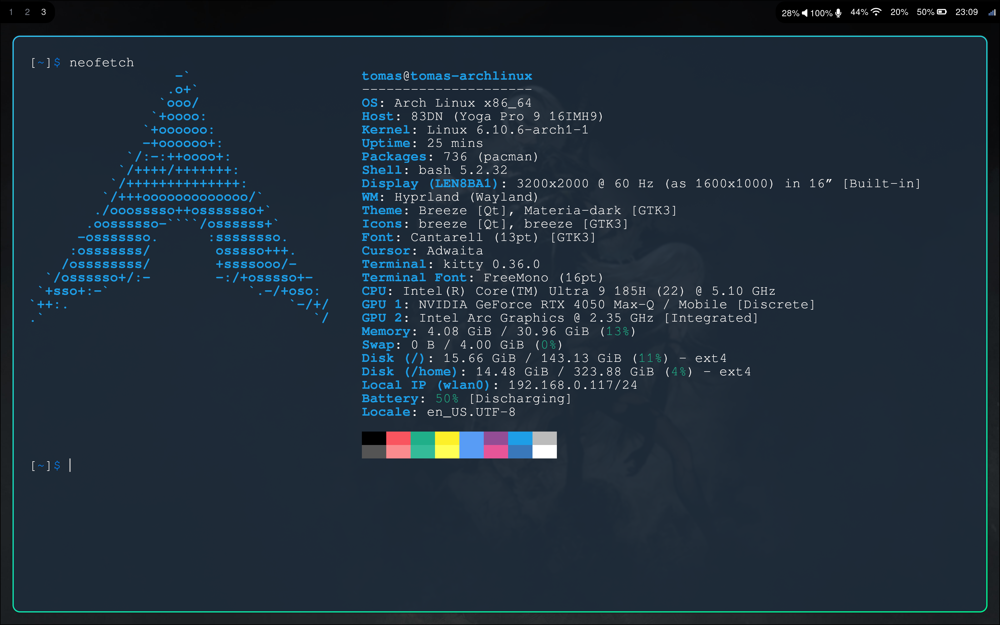

# My Hyprland Dotfiles



## Installation

Clone the repository to `~/dotfiles` using git

```
$ cd
$ git clone https://github.com/zloutek1/dotfiles-hyprland.git dotfiles
$ cd dotfiles
```

### Yay

Install yay AUR package helper

```
git clone https://aur.archlinux.org/yay-bin
cd yay-bin
makepkg -si
```

### Stow

Then using GNU Snow create symlinks in your home directory. Non-existing files will be symlinked
Stow copied the files one directory up

```
$ stow .
```
